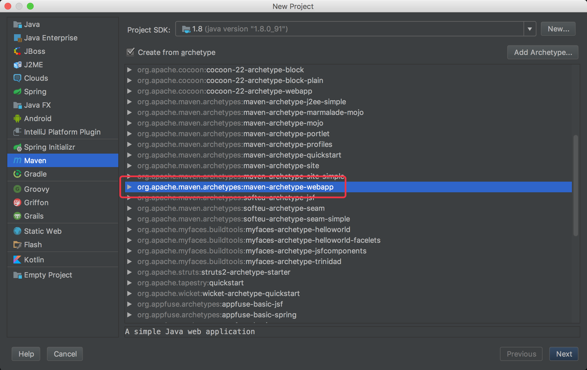
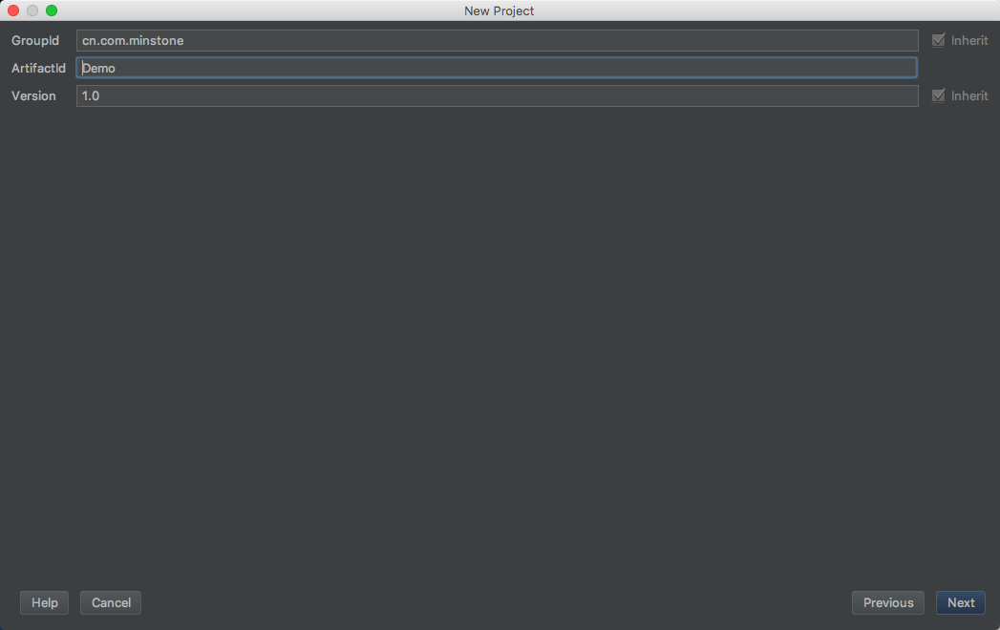
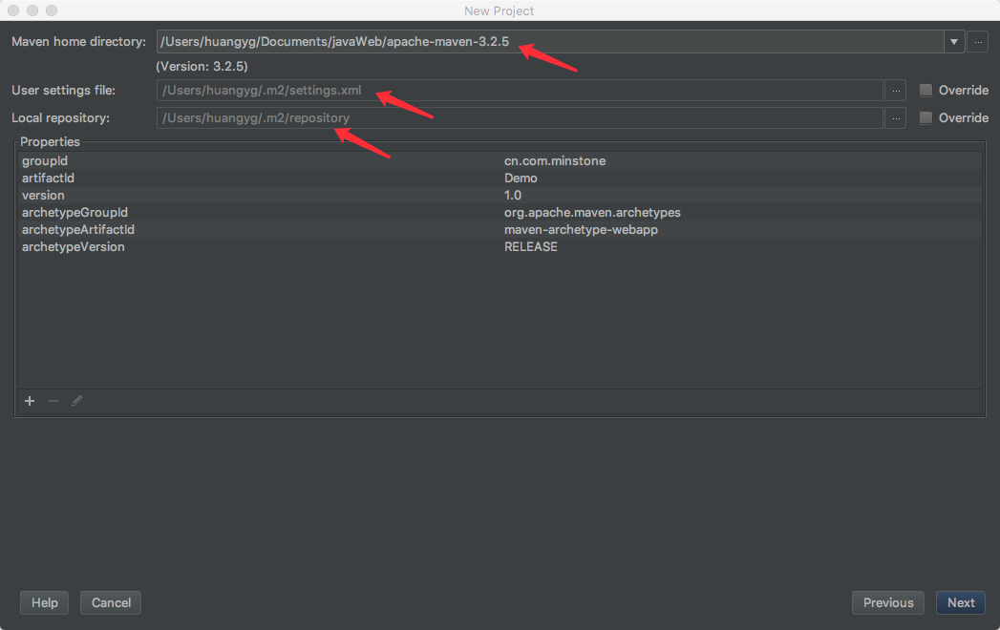
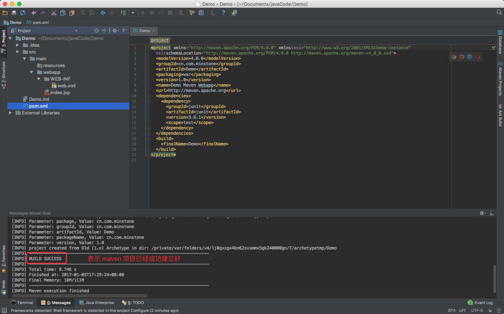
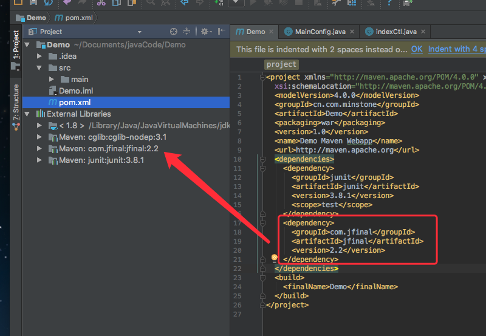
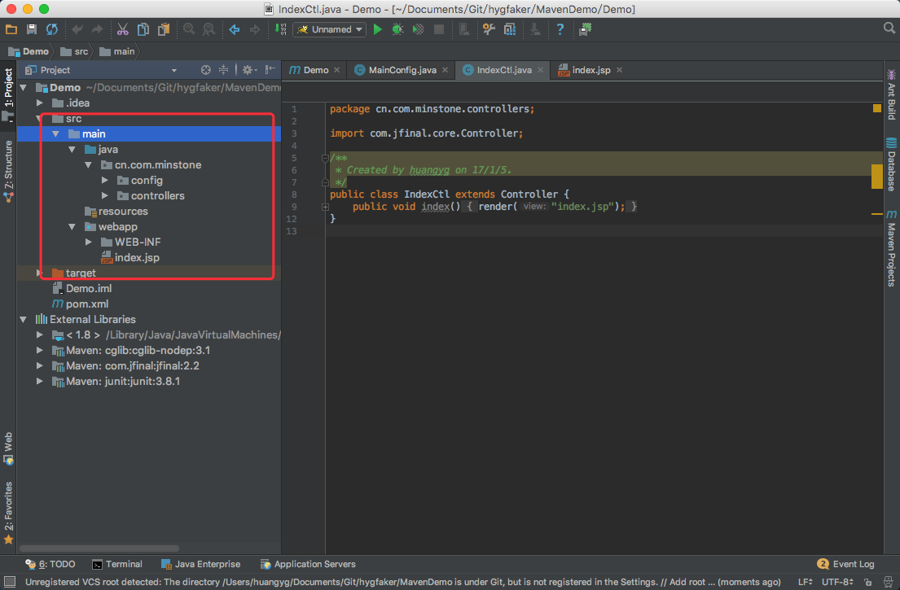
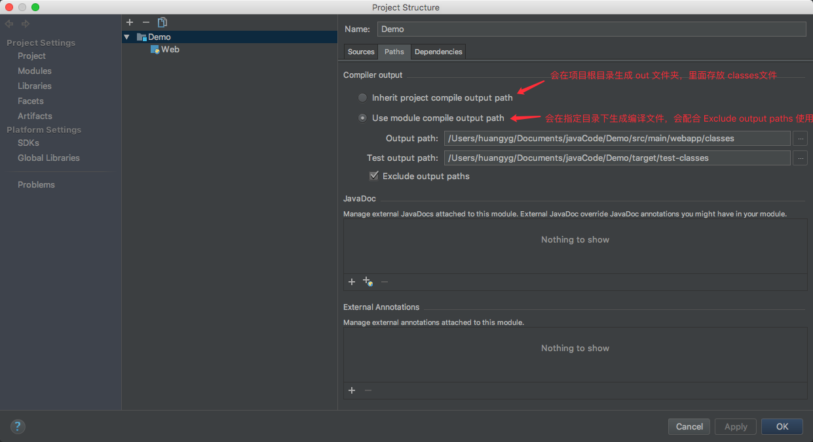
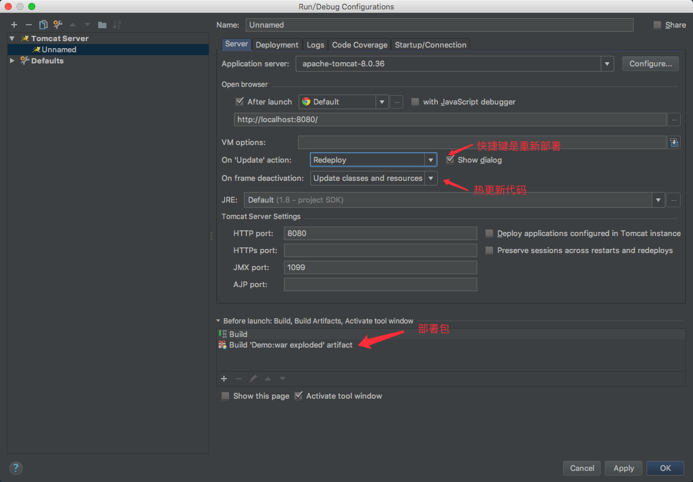
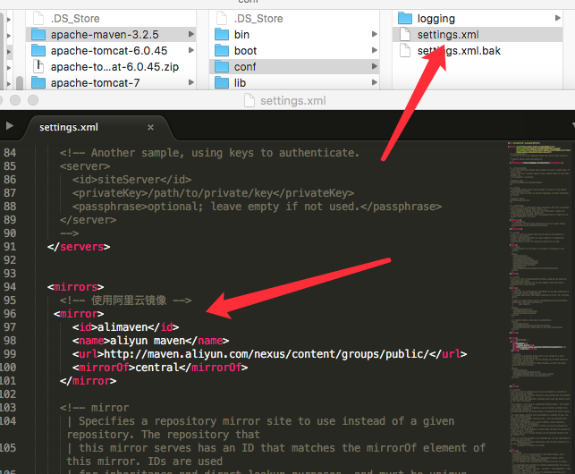

###使用 idea 创建 Maven 项目--引用jfinal

- 创建 Maven 的 web 模板项目

- 编写好相关信息：

- 选择要用到的 maven 版本，注意在 maven 中设置好阿里云镜像。

- 点击下一步直到创建好项目，如下图：

- 在 pom.xml 中引入 jfinal

- 从创建好的项目中可以看到还差一个 java 目录，这里我们可以手动创建并且设置为源文件。

- 添加好 jfinal 依赖后，编写好相关 jfinal 的代码。配置好项目输出路径和 tomcat 服务器。

>修改 maven 镜像源:
>

